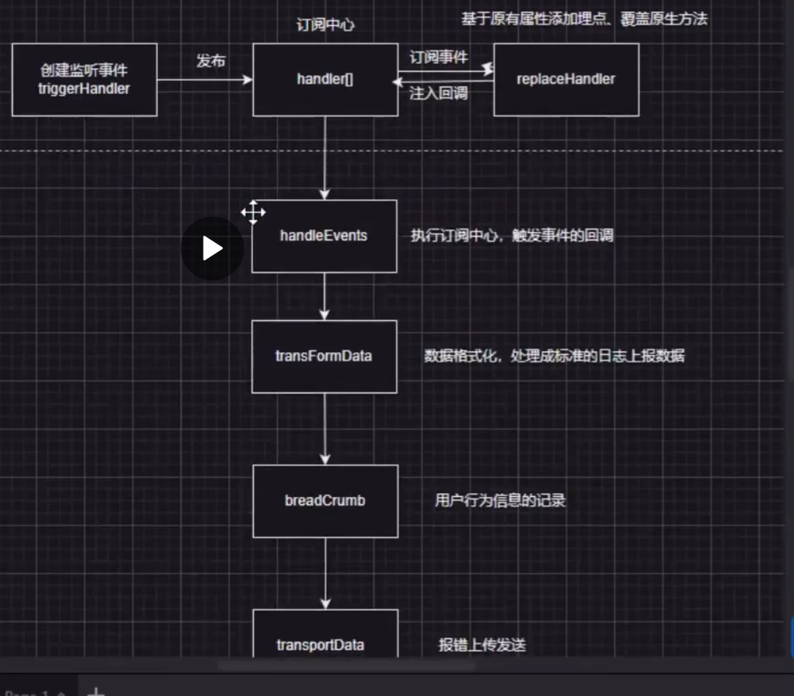

# 前端稳定性监控

## 前端稳定性

前端稳定性 => 前端监控系统

1.  学习稳定性监控的完整流程
2.  稳定性指标
3.  稳定性上传
4.  Node 接收数据
5.  看板内容展示存储

解决两个问题

1. 如何发现问题
2. 如何快速定位问题

具体指标

1. 收集错误
   1. 稳定性情况： JS 异常、接口、资源异常
   2. 用户行为信息、访问路径
   3. 页面性能
   4. 数据上传
2. 整理存储错误
3. 可视化

### 错误信息收集

1. 接口异常 ： xhr、fetch
2. 代码、资源异常收集 ： window.error 通过 localName 判断是否是资源异常的方式 3
3. Promise 异常： unhandledrejection 事件
4. 行为信息收集： click、historyChange、hashChange
5. console

### 目前主流前端框架如何收录问题

1. react

```js
function errorBoundaryreport(e) {
  // e 数据处理 Error
  e.type = 'react_error';
  sendLog;
}

// react 组件
componentDidCatch(e){
  encodemonitor.errorBoundaryreport(e)
}
```

2. Vue: 以插件化的形式插入到 Vue 中

   ```js
   const MonitorVue = {
     install(Vue) {
       Vue.config.errorHandler = (err, vm, info) => {};
     },
   };
   ```

### 面试中经常考察的内容

#### 可预防

1. 提供标准化研发流程：
   1. cli eslint prettier tsConfig
   2. 文档沉淀
   3. 组件库 npm code snippet
   4. jest
2. 演练
   1. 压测
      1. 模拟用户高并发访问
      2. 测试页面加载性能
      3. 测试接口响应时间
      4. 关键指标：页面加载时间、资源加载时间、错误率
      5. 步骤
         1. 确定压测目标
         2. 选择压测工具
         3. 配置压测环境
         4. 便携压测脚本
         5. 运行压测测试
         6. 监控和分析结果
         7. 优化和迭代
   2. Code Review 问题注入 CR 注入
3. 灰度方案:
   1. 快速发布快速回滚
   2. cdn 分流 ： 利用 CDN 将流量分散到不同的服务器上，提高系统的可用性和扩展性，可以利用 CDN 的分流功能，将部分用户的请求导向新版本的服务器
   3. proxy 代理 ： 通过代理服务器来转发请求，实现流量的控制和路由，在灰度发布中，可以利用代理服务器来根据 UA 或 IP 地址将请求转发到不同的服务器上
   4. 代码区分：grey UA IP： 根据用户代理 UA、IP 地址 来实现灰度发布

#### 可监控

##### 数据采集

1. 无埋点，自动发布采集到的信息
   1. JS 异常
   2. 接口异常
   3. 资源异常、代码异常
   4. Promise catch 异常 unhandleRejection
   5. 框架异常
      1. React：componentDidCatch
      2. Vue： Vue.config.errorHandler
   6. 行为跟踪: click hash history
   7. performance 指标

##### 数据转换

针对不同的监控类型做不同的转换

##### 数据上报

xhr、img、sendBeacon

##### 数据清洗

阈值处理

##### 数据持久化、可视化

数据库、数据报表

#### 可回滚

##### 容器化部署 ： 暂时理解较难

1. 代码和代码所依赖的环境聚合
2. 代码和配置项一起打包构建

##### 数据迁移

1. 只增不删

### 架构设计

1. 对前端监控埋点的统一架构设计
   1. trigger 触发订阅中心 也就是 handler 对象中对应的 type 类型的所有回调函数
   2. 初始化的时候，会根据不同的类型，将对应的回调函数 push 到 handler 中对应的类型数组里
   3. 当监听的时间执行后，会触发 handler 中对应的 type 中的回调
   4. 将行为记录在维护的行为队列中
   5. 然后进行一个标准化的数据处理
   6. 最后对需要上报的类型进行上报发送到服务端
2. 聚合错误信息，进行统一的接口层封装
   

#### 用户行为收集

提供标准化的收录，记录用户行为，分析用户轨迹画像

breadcrumb 行为队列

1.  xhr
2.  image 上报

#### 自定义数据发送

### 性能指标收集

定量数据
performance

1. 页面加载 largest contentful pailt LCP
2. 互动 first input delay fid
3. CLS 视觉稳定性 cumulative layout shift

#### 指标口径

1. CLS 视觉稳定性：
   1. performanceObserve

   ```js
   const getCLS = (cls) => {
     if (!supportPerformanceObserver) {
       console.warn();
       return;
     }
     //  cosnt po = new PerformanceObserver(l=>l.getEntries().map(cb)).observer({type:'layout-shift'})
     //
   };
   ```

## 完整日志上报链路

### 微信小程序

#### 请求

#### 路由

1. switchTab
2. relauch
3. redirectTo
4. navigateTo
5. navigateBack
6. navigateTominiProgram
7. routeFail

#### error

### 日志上报链路

#### 埋点方案

1. 代码埋点
   1. 任何时候，任何地点上报数据
   2. 额外添加开发时间
2. 可视化埋点
   1. 方便
   2. 开发系统
3. 无埋点
   1. 全量数据
   2. 服务端压力

#### 设计方案

1. 多端、全量
   1. 页面信息、用户行为：机型、首页数据、UV、PV、性能指标、用户行为栈
   2. 上报信息：click、xhr、fetch、error、request 刻画用户行为
   3. 异常事件：error 、 catch

定量数据
定性数据
衡量系统稳定性好坏的指标

#### 上报周期、数据类型

1. who appid ua
2. when timestap
3. where
4. what data extra_info

## 前端流程优化处理

### script error

1. 跨域报错： cdn 文件访问资源（资源中内容报错），无法把具体的错误抛出
   1. try catch cb monitor.log(e)
   2. 代码放到同一域名： 同源化 download、放到自身域名下内联资源
   3. cors corss orign resource sharing 跨域资源共享
      1. cross origin ： anonymous 以匿名的方式访问跨域脚本，不会发送用户信息
      2. Access-Control-Allow-Origin ：""
      3. Vary: origin // 避免因协议和域名变化导致的错误 兼容性较差

### sourceMap

## 服务功能介绍

apiKey：区分项目名称

### redis

    redis.hash => apikey
    redis.string => 存储用户信息
    数据库存储
    用户ID 时间 用户身份 签到信息

    database： 完整的明细行为、受限于数据库的连接池数量
    bitmap key : 日期 value：userId  100000B 10k

### mysql

    项目 人 error信息 error level

### 具体流程

1. 所有的事情先进行获取，提取对应的信息到 redis.list 队列
2. 定时任务消耗队列
3. 根据错误信息划分错误行为
4. 三分钟定时任务 获取 前 1000 条数据
5. 错误展示：数量大但是时效性要求不高
6. 错误告警：某类错误 5min 超过阈值 10 个 webHooks => dingdign weixin email

## 稳定性治理、稳定性预防

### 稳定性治理

项目上线后，如何通过治理手段，将业务稳定性大幅度提升

#### 约定上报流程，流程规范化

       1. 提供标准化的上报方式=>技术手段约束用户的行为动作
          1. 当前上下文 url、role、permission、error、用户行为栈、desc、pic
          2. map 一键工单 url => map => dev
          3. 反馈频次较高的问题沉淀 案例 以往案例分析
          4. 值班用户 IM 人工答疑
       2. 行为需求统计迭代
          1. pool 录入需求池
          2. 按照开发流程走迭代
       3. 明确核心稳定性指标
          1. TO C ： FCP 首屏加载、秒开率 performance JS
          2. TO B ： 可用性高，用户反馈问卷、a => b => c => d uv、pv
       4. action
          1. 横向： 秒开率 30% => 50%
          2. 纵向： 高频访问页面
       5. 定期进行稳定性会议
          1. 具体的性能优化

#### 鼓励措施

1. 稳定性治理排名
2. 个人 => 推广到团队

### 稳定性预防、保障

基于怎样的技术规范与机制保证项目稳定性

1. 灰度策略： 避免新功能一次性全量发布
2. 发布流程规范： 回归测试标准要清晰：明确稳定性指标影响范围 档次发布梳理 case 回归所有的核心链路流程
3. log：添加核心流程的日志记录，保证问题可溯源，有数据可查
4. 手动埋点：业务埋点
5. 兜底处理： 优雅降级、渐进升级
6. 多活： 依赖多个服务器节点、主从依赖处理、确保系统正常可用
7. 上线规划： 根据当前系统的使用率，选择发布节点

   ### 值班机制
   1. 报警值班
   2. 上线值班 code Review
   3. 指标巡检 定期巡检

   ### 稳定性总结
   1. 归因，避免下次犯错
   2. 事前预防
   3. 事中快速处理
   4. 事后总结
   5. 落地行为 action
